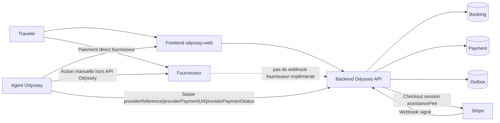
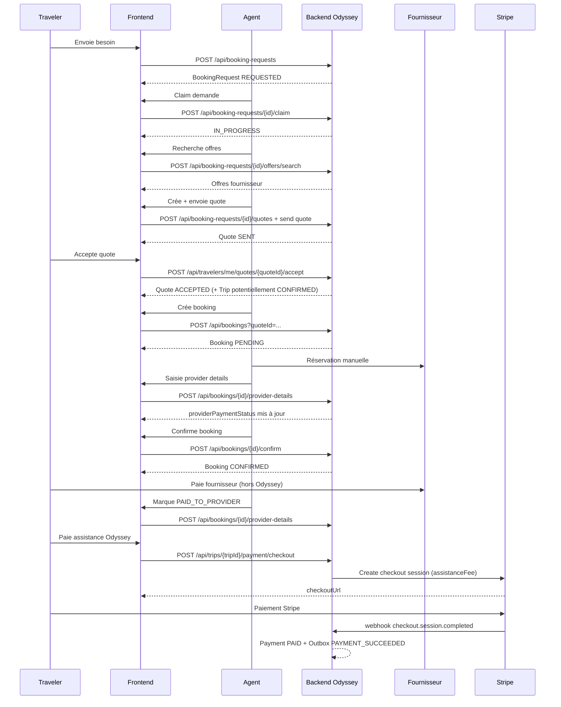

# Architecture fournisseur Odyssey

## 1. Objectif

Ce document décrit l'architecture fournisseur réellement implémentée dans Odyssey (backend + frontend), pour comprendre :

- le workflow opérationnel actuel,
- les invariants métier effectivement garantis par le code,
- les zones manuelles,
- les limites actuelles,
- et les pistes d'évolution (non implémentées) vers des API fournisseurs.

## 2. Principes métier

### CURRENT / ACTUEL

Principes explicitement portés par le code :

- Odyssey n'encaisse que ses frais d'assistance via Stripe.
- Le paiement fournisseur est direct Traveler -> Fournisseur, hors Stripe Odyssey.
- L'éligibilité au paiement Stripe est bloquée tant que les besoins actifs ne sont pas tous prêts côté fournisseur.

Preuves techniques :

- `PaymentService.createCheckoutSession(...)` ne crée Stripe que pour `assistanceFee` :
  - `src/main/java/com/odyssey/api/payment/PaymentService.java`
- `Payment` documente que `assistanceFee` est la seule valeur collectée :
  - `src/main/java/com/odyssey/api/payment/Payment.java`
- Le webhook Stripe ne marque `PAID` qu'après réconciliation montant/devise attendus :
  - `src/main/java/com/odyssey/api/payment/PaymentService.java`

### FUTURE / NON IMPLÉMENTÉ

- Encaissement fournisseur par Odyssey (marketplace, split payment, escrow).
- Vérification automatique d'un paiement fournisseur via webhook/API fournisseur.

## 3. Modèle de domaine

### CURRENT / ACTUEL

Objets principaux dans le workflow fournisseur/paiement :

- `Trip` (`DRAFT`, `CONFIRMED`, `CANCELLED`)
- `Need` (rattaché à `Trip`)
- `BookingRequest` (`REQUESTED`, `IN_PROGRESS`, `QUOTED`, `CONFIRMED`, `CANCELLED`, `COMPLETED`)
- `Quote` (`DRAFT`, `SENT`, `ACCEPTED`, `REJECTED`, `EXPIRED`)
- `Booking` (`PENDING`, `CONFIRMED`, `FAILED`, `CANCELLED`)
- `ProviderPaymentStatus` (`NOT_REQUIRED_YET`, `PAYMENT_REQUIRED`, `PAID_TO_PROVIDER`, `UNKNOWN`)
- `Payment` (`PENDING`, `PAID`, `FAILED`) pour les frais Odyssey

Fichiers :

- `src/main/java/com/odyssey/api/trip/Trip.java`
- `src/main/java/com/odyssey/api/booking/BookingRequest.java`
- `src/main/java/com/odyssey/api/quote/Quote.java`
- `src/main/java/com/odyssey/api/booking/confirmation/Booking.java`
- `src/main/java/com/odyssey/api/payment/Payment.java`
- `src/main/java/com/odyssey/api/booking/confirmation/ProviderPaymentStatus.java`

Relations clés :

- 1 `Trip` -> N `Need`
- 1 `Need` -> 0..1 `BookingRequest`
- 1 `BookingRequest` -> N `Quote`
- 1 `Quote` -> 0..1 `Booking` (unicité en base)
- 1 `Trip` -> 0..1 `Payment` (unicité en base)

### FUTURE / NON IMPLÉMENTÉ

- Entité de transaction fournisseur vérifiable automatiquement (webhook/provider_tx_id).
- Historique normalisé des tentatives de réservation fournisseur multi-fournisseurs.

## 4. Architecture actuelle

### CURRENT / ACTUEL

- Backend Spring Boot centralise les règles métier.
- Le frontend agent orchestre fortement des étapes manuelles.
- Les événements métier sont persistés en outbox puis republés en événements Spring internes.
- Stripe est intégré via `StripeGateway` (implémentation SDK Stripe).
- Les fournisseurs sont simulés côté recherche/confirmation (`Fake*Provider`).

Composants backend :

- Booking :
  - `src/main/java/com/odyssey/api/booking/confirmation/BookingController.java`
  - `src/main/java/com/odyssey/api/booking/confirmation/BookingService.java`
- Quotes :
  - `src/main/java/com/odyssey/api/quote/QuoteService.java`
  - `src/main/java/com/odyssey/api/quote/TravelerQuoteController.java`
- Payment Stripe :
  - `src/main/java/com/odyssey/api/payment/PaymentController.java`
  - `src/main/java/com/odyssey/api/payment/PaymentService.java`
  - `src/main/java/com/odyssey/api/payment/stripe/StripeGatewayImpl.java`
- Outbox + listeners :
  - `src/main/java/com/odyssey/api/outbox/OutboxProcessor.java`
  - `src/main/java/com/odyssey/api/event/AgentNotificationEventListener.java`
  - `src/main/java/com/odyssey/api/event/ClientEmailEventListener.java`

Composants frontend impactants :

- Agent :
  - `../odyssey-web/src/pages/BookingRequestPage.tsx`
  - `../odyssey-web/src/components/AgentBookingModal.tsx`
- Traveler :
  - `../odyssey-web/src/pages/traveler/TravelerTripDetailPage.tsx`
  - `../odyssey-web/src/components/TravelerTripFinances.tsx`
  - `../odyssey-web/src/pages/traveler/TravelerQuotesPage.tsx`

### FUTURE / NON IMPLÉMENTÉ

- Couche d'abstraction fournisseur unifiée appliquée à toute la chaîne réservation/paiement/annulation.

## 5. Workflow complet

### CURRENT / ACTUEL

Flux réel reconstruit depuis le code :

1. Traveler envoie un besoin à organiser
- Acteur : Traveler
- Endpoint : `POST /api/booking-requests`
- Service : `BookingRequestService.createBookingRequest(...)`
- Entités : `BookingRequest`, `Need`
- Avant : `Need` sans `BookingRequest`
- Après : `BookingRequest.REQUESTED`, `Need.REQUESTED`
- Validations : unicité `BookingRequest` par `Need`
- Erreurs : need inexistant, demande déjà existante

2. Agent prend la demande
- Acteur : Agent
- Endpoint : `POST /api/booking-requests/{id}/claim`
- Service : `BookingRequestService.claimBookingRequest(...)`
- Entités : `BookingRequest`
- Avant : `REQUESTED`, non assignée
- Après : `IN_PROGRESS`, agent assigné
- Validations : non déjà assignée
- Erreurs : booking request/agent non trouvés, déjà assignée

3. Agent recherche des offres fournisseur
- Acteur : Agent
- Endpoint : `POST /api/booking-requests/{id}/offers/search`
- Service : `ProviderSearchService.search(...)`
- Entités : aucune mutation métier persistée
- Validations : critères présents
- Erreurs : booking request/criteria absents

4. Agent crée une quote
- Acteur : Agent
- Endpoint : `POST /api/booking-requests/{id}/quotes`
- Service : `QuoteService.createQuote(...)`
- Entités : `Quote`
- Avant : `BookingRequest.IN_PROGRESS`
- Après : `Quote.DRAFT`
- Validations : demande en `IN_PROGRESS`, agent assigné propriétaire, montants >= 0
- Erreurs : statut invalide, agent non autorisé

5. Agent envoie la quote
- Acteur : Agent
- Endpoint : (via service d'envoi quote/trip)
- Service : `QuoteService.sendQuote(...)` ou `sendDraftQuotesForTrip(...)`
- Entités : `Quote`, `OutboxEvent`
- Avant : `Quote.DRAFT`
- Après : `Quote.SENT`, outbox `QUOTE_SENT` ou `TRIP_QUOTES_SENT`

6. Traveler accepte/refuse
- Acteur : Traveler
- Endpoints :
  - `POST /api/travelers/me/quotes/{quoteId}/accept`
  - `POST /api/travelers/me/quotes/{quoteId}/reject`
- Service : `QuoteService.acceptQuote(...)`, `rejectQuote(...)`
- Entités : `Quote`, `Trip` (éventuellement), `OutboxEvent`
- Avant : `Quote.SENT`
- Après : `Quote.ACCEPTED` ou `Quote.REJECTED`
- Validations : quote du traveler courant, statut `SENT`

7. Auto-confirmation du trip si toutes les booking requests actives ont une quote courante acceptée
- Service : `QuoteService.updateTripConfirmationIfReady(...)`
- Règle : pour chaque booking request active (non `CANCELLED`), la quote courante (id max) doit être `ACCEPTED`
- Après : `Trip.CONFIRMED`

8. Agent crée un booking pour une quote acceptée
- Acteur : Agent
- Endpoint : `POST /api/bookings?quoteId=...`
- Service : `BookingService.createBooking(...)`
- Entités : `Booking`
- Avant : quote `ACCEPTED`
- Après : booking `PENDING`, `providerPaymentStatus=NOT_REQUIRED_YET`
- Validations : quote `ACCEPTED`, agent assigné, unicité booking/quote

9. Agent renseigne détails fournisseur
- Acteur : Agent
- Endpoint : `POST /api/bookings/{bookingId}/provider-details`
- Service : `BookingService.updateProviderDetails(...)`
- Entités : `Booking`
- Données : `providerReference`, `providerPaymentUrl`, `providerPaymentStatus`
- Spécificité : `providerPaymentStatus` librement modifiable par l'agent (pas de garde de transition)

10. Agent confirme booking
- Acteur : Agent
- Endpoint : `POST /api/bookings/{bookingId}/confirm`
- Service : `BookingService.confirmBooking(...)`
- Entités : `Booking`, `BookingRequest`
- Avant : booking `PENDING` et `providerReference` non vide
- Après : booking `CONFIRMED` + `providerConfirmationId`, booking request `COMPLETED`

11. Traveler paie Odyssey (Stripe), seulement si éligible
- Acteur : Traveler
- Endpoint : `POST /api/trips/{tripId}/payment/checkout`
- Service : `PaymentService.createCheckoutSession(...)`
- Conditions :
  - trip du traveler,
  - trip `CONFIRMED`,
  - `isTripAssistanceFeePayable(tripId)==true` : toutes booking requests actives non `CANCELLED` ont un booking `CONFIRMED` avec `providerPaymentStatus=PAID_TO_PROVIDER`
- Entités : `Payment` (création/réutilisation)
- Après : `Payment.PENDING` + session Stripe

12. Webhook Stripe
- Acteur : Stripe
- Endpoint : `POST /api/payments/webhook`
- Service : `PaymentService.handleWebhookPayload(...)` puis `processVerifiedEvent(...)`
- Cas succès : `checkout.session.completed`
- Conditions succès : session trouvée + montant/devise exactement conformes à `assistanceFee` + `currency`
- Après : `Payment.PAID` (CAS SQL) + outbox `PAYMENT_SUCCEEDED`
- Cas échec terminal : `checkout.session.expired` ou `checkout.session.async_payment_failed` -> `Payment.FAILED` si encore `PENDING`

### FUTURE / NON IMPLÉMENTÉ

- Création/confirmation de réservation fournisseur via API tierce réelle (hors fake).
- Détection automatique du paiement fournisseur.

## 6. Workflow Agent

### CURRENT / ACTUEL

Workflow opérationnel Agent (réel) :

1. Consulter/claim une booking request
- Statut : semi-automatique

2. Lancer recherche d'offres fournisseur
- Statut : semi-automatique (appel backend automatisé, choix humain)

3. Créer quote puis envoyer au traveler
- Statut : manuel

4. Attendre acceptation traveler
- Statut : automatique (événements/notifs)

5. Créer booking (`PENDING`) sur quote acceptée
- Statut : manuel

6. Effectuer réservation fournisseur hors Odyssey
- Statut : manuel

7. Saisir `providerReference` / `providerPaymentUrl` / `providerPaymentStatus`
- Statut : manuel

8. Confirmer booking côté Odyssey
- Statut : manuel (avec précondition `providerReference`)

9. Mettre à jour plus tard le statut paiement fournisseur (`PAID_TO_PROVIDER`)
- Statut : manuel

Point important : aucune automatisation fournisseur de bout en bout n'est implémentée (réservation, paiement, annulation).

### FUTURE / NON IMPLÉMENTÉ

- Agent assisté par adapters fournisseur (préremplissage, vérification auto, synchronisation statut).

## 7. Booking lifecycle

### CURRENT / ACTUEL

Machine d'état observée dans le code :

- Création : `PENDING` dans `BookingService.createBooking(...)`
- Confirmation : `PENDING -> CONFIRMED` via `Booking.confirm()` appelé par `BookingService.confirmBooking(...)`
- Préconditions de confirmation :
  - statut courant `PENDING`
  - `providerReference` non vide

Important :

- `FAILED` et `CANCELLED` existent dans l'enum mais aucune transition active n'a été trouvée dans le code métier actuel.

### FUTURE / NON IMPLÉMENTÉ

- Transitions explicites vers `FAILED`/`CANCELLED` avec raisons et audit.

## 8. ProviderPayment lifecycle

### CURRENT / ACTUEL

États :

- `NOT_REQUIRED_YET`
- `PAYMENT_REQUIRED`
- `PAID_TO_PROVIDER`
- `UNKNOWN`

Transitions :

- À la création booking : forcé à `NOT_REQUIRED_YET`.
- Ensuite : défini par `updateProviderDetails(...)` sans garde stricte de transition.

Conclusion : il s'agit d'un statut déclaratif saisi par l'agent, pas d'un automate validé techniquement par des preuves externes.

Indépendance avec `BookingStatus` :

- `BookingStatus` décrit l'avancement de la réservation.
- `ProviderPaymentStatus` décrit la connaissance du paiement fournisseur.
- Un booking peut être `CONFIRMED` tout en restant `PAYMENT_REQUIRED`.
- Le paiement Odyssey exige explicitement `CONFIRMED` ET `PAID_TO_PROVIDER` sur les booking requests actives.

### FUTURE / NON IMPLÉMENTÉ

- Transition contrôlée par événements fournisseur réels (webhook/API status).

## 9. Paiement fournisseur

### CURRENT / ACTUEL

Flux Traveler -> Fournisseur :

- Qui fournit le payment URL : aujourd'hui l'agent, via `updateProviderDetails(...)`.
- Où il est stocké : `Booking.providerPaymentUrl`.
- Comment le traveler y accède :
  - quotes traveler (`TravelerQuotesPage.tsx`)
  - section finances trip (`TravelerTripFinances.tsx`)
- Comment Odyssey sait que c'est payé : seulement par saisie agent (`providerPaymentStatus=PAID_TO_PROVIDER`).
- Qui peut changer ce statut : endpoint agent `POST /api/bookings/{bookingId}/provider-details`.
- Validations : contrôle d'ownership agent sur booking request ; pas de validation externe du paiement.

### FUTURE / NON IMPLÉMENTÉ

- Webhook/API fournisseur pour confirmer automatiquement le paiement.

## 10. Paiement Odyssey

### CURRENT / ACTUEL

Flux Traveler -> Stripe -> Odyssey :

- Montant : uniquement `assistanceFee`.
- Endpoint de démarrage : `POST /api/trips/{tripId}/payment/checkout`.
- Conditions d'éligibilité (backend) :
  - traveler propriétaire du trip,
  - trip `CONFIRMED`,
  - `isTripAssistanceFeePayable` vrai,
  - booking requests `CANCELLED` ignorées,
  - pour chaque booking request active : booking présent, `CONFIRMED`, `PAID_TO_PROVIDER`.
- Gestion concurrence/idempotence :
  - lock pessimiste trip (`findByIdForUpdate`),
  - un seul `Payment` par trip (contrainte unique),
  - `checkoutAttempt` et idempotency key Stripe.
- Webhook :
  - signature vérifiée via `StripeGateway.verifyAndParseEvent(...)`,
  - CAS SQL pour `PAID`,
  - outbox `PAYMENT_SUCCEEDED` sur succès,
  - `FAILED` sur expiration/échec async si encore `PENDING`.

Invariant critique : le prix fournisseur ne doit jamais être encaissé via Stripe Odyssey.

### FUTURE / NON IMPLÉMENTÉ

- Orchestration multi-PSP.
- Remboursements (`REFUNDED`) non implémentés.

## 11. Invariants métier

### CURRENT / ACTUEL

Invariants démontrés par code et tests :

- Un booking n'est créable que pour quote `ACCEPTED`.
- Un seul booking par quote.
- Un seul payment Odyssey par trip (réutilisation des tentatives).
- Le webhook ne marque pas `PAID` si montant/devise divergent de l'attendu.
- Les webhooks dupliqués sont idempotents (CAS SQL).
- Les booking requests `CANCELLED` sont exclues du calcul d'éligibilité Stripe.

Preuves tests :

- `src/test/java/com/odyssey/api/booking/confirmation/BookingServiceTest.java`
- `src/test/java/com/odyssey/api/payment/PaymentServiceTest.java`
- `src/test/java/com/odyssey/api/payment/PaymentServiceCheckoutConcurrencyTest.java`

### FUTURE / NON IMPLÉMENTÉ

- Invariants techniques sur paiements fournisseur (preuve externe obligatoire).

## 12. Endpoints concernés

### CURRENT / ACTUEL

Booking request / search / quote :

- `POST /api/booking-requests`
- `POST /api/booking-requests/{id}/claim`
- `POST /api/booking-requests/{id}/offers/search`
- `POST /api/booking-requests/{bookingRequestId}/quotes`
- `GET /api/booking-requests/{bookingRequestId}/quotes`

Quotes traveler :

- `GET /api/travelers/me/quotes`
- `POST /api/travelers/me/quotes/{quoteId}/accept`
- `POST /api/travelers/me/quotes/{quoteId}/reject`

Booking :

- `POST /api/bookings?quoteId=...`
- `POST /api/bookings/{bookingId}/provider-details`
- `POST /api/bookings/{bookingId}/confirm`
- `GET /api/bookings/by-quote/{quoteId}`

Paiement Odyssey :

- `POST /api/trips/{tripId}/payment/checkout`
- `POST /api/payments/webhook`

## 13. Événements / Outbox

### CURRENT / ACTUEL

Événements outbox persistés :

- `BOOKING_REQUESTED`
- `BOOKING_ASSIGNED`
- `QUOTE_SENT`
- `TRIP_QUOTES_SENT`
- `QUOTE_ACCEPTED`
- `QUOTE_REJECTED`
- `PAYMENT_SUCCEEDED`

Pipeline :

- écriture en transaction métier,
- polling `OutboxProcessor` toutes les 5s,
- claim atomique `PENDING -> PROCESSING`,
- publication Spring `ApplicationEventPublisher`,
- `PROCESSED` sinon retry (retour `PENDING`).

Points notables :

- Aucun événement outbox dédié à `Booking created` ou `Booking confirmed` n'a été trouvé.
- Le paiement fournisseur n'est pas piloté par webhook fournisseur.

## 14. Diagramme architecture Mermaid

### CURRENT / ACTUEL

## 15. Sequence diagram Mermaid

### CURRENT / ACTUEL

## 16. Responsabilités par acteur

### CURRENT / ACTUEL

Traveler :

- créer les besoins,
- accepter/refuser les quotes,
- payer le fournisseur sur URL externe,
- payer les frais Odyssey via Stripe quand éligible.

Agent :

- claim et traitement opérationnel,
- recherche d'offres,
- création/envoi quote,
- création booking,
- réservation fournisseur réelle,
- saisie manuelle des informations fournisseur et statut de paiement,
- confirmation booking.

Backend Odyssey :

- faire respecter ownership/statuts/invariants,
- exposer les endpoints,
- orchestrer Stripe et webhook,
- publier des événements outbox.

Stripe :

- héberger checkout Odyssey,
- pousser webhooks signés.

Fournisseur :

- fournir service de voyage,
- encaisser le traveler directement.

## 17. Limites actuelles

### CURRENT / ACTUEL

| Limite | Classification | Justification |
|---|---|---|
| Réservation fournisseur manuelle | Constaté dans l'implémentation | `FakeBookingProvider` et saisie agent des données fournisseur |
| Vérification paiement fournisseur non automatique | Constaté dans l'implémentation | `ProviderPaymentStatus` modifié via endpoint agent, sans preuve externe |
| Pas de webhook fournisseur | Constaté dans l'implémentation | Aucun endpoint/listener webhook fournisseur |
| Dépendance forte à l'agent | Constaté dans l'implémentation | étapes critiques opérées dans `BookingRequestPage` + `AgentBookingModal` |
| Risque de divergence de vérité terrain sur paiement fournisseur | Déduit de l'architecture | statut déclaratif agent sans intégration fournisseur |
| Cohérence potentiellement fragile UI/Backend sur certaines règles | Constaté dans l'implémentation | voir section points de vigilance (écarts observés) |
| Disponibilité/prix fournisseur en temps réel garantis | À vérifier | dépend des providers branchés; implémentation actuelle majoritairement fake |

## 18. Architecture future avec APIs fournisseurs

### FUTURE / NON IMPLÉMENTÉ

Objectif : conserver le workflow métier Odyssey, tout en remplaçant progressivement les actions manuelles selon le niveau d'API disponible par fournisseur.

Capacités cibles (interfaces logiques) :

- `searchOffers()`
- `checkAvailability()`
- `createReservation()`
- `getReservation()`
- `getPaymentUrl()`
- `getPaymentStatus()`
- `cancelReservation()`

Support mixte simultané :

- Fournisseur A : API complète
- Fournisseur B : recherche seulement
- Fournisseur C : pas d'API (fallback agent)

Principe : la couche métier Odyssey reste stable, seul le mode d'exécution fournisseur varie.

## 19. Stratégie ProviderAdapter/Gateway potentielle

### FUTURE / NON IMPLÉMENTÉ

Option recommandée : `ProviderAdapter` (ou `ProviderGateway`) par fournisseur.

Avantages :

- encapsulation des différences d'API,
- fallback agent explicite quand une capacité n'existe pas,
- meilleure testabilité,
- évolution incrémentale sans casser le domaine.

Inconvénients :

- complexité d'orchestration (timeouts, retries, idempotence externe),
- besoin d'un modèle d'état fournisseur plus riche,
- observabilité plus exigeante.

Compatibilité avec l'existant :

- s'aligne avec la séparation actuelle booking/paiement Odyssey,
- peut s'introduire progressivement derrière les services existants.

## 20. Automatisation progressive

### CURRENT / ACTUEL + FUTURE / NON IMPLÉMENTÉ

| Fonction | Aujourd'hui | Avec API | Fallback |
|---|---|---|---|
| Recherche | Appel backend + providers agrégés, sélection humaine agent | searchOffers + scoring/normalisation | Agent |
| Disponibilité | Pas de garantie de check live bout en bout | checkAvailability | Agent |
| Réservation | Manuelle (hors système fournisseur réel) | createReservation | Agent |
| Confirmation | Manuelle via `confirmBooking` | getReservation + auto-confirm conditionnelle | Agent |
| Payment URL | Saisie manuelle agent dans booking | getPaymentUrl | Agent |
| Vérification paiement | Saisie manuelle `PAID_TO_PROVIDER` | getPaymentStatus/webhook fournisseur | Agent |
| Annulation | Non implémenté dans ce workflow | cancelReservation | Agent |

## 21. Gestion des fournisseurs sans API

### CURRENT / ACTUEL

Le mode manuel est déjà le mode dominant :

- l'agent exécute l'opération fournisseur hors Odyssey,
- saisit les preuves minimales (`providerReference`, `providerPaymentUrl`, `providerPaymentStatus`),
- confirme ensuite le booking côté Odyssey.

### FUTURE / NON IMPLÉMENTÉ

Même avec adapters, ce mode manuel doit rester un chemin standard de fallback.

## 22. Points de vigilance

### CURRENT / ACTUEL

1. Écart backend/frontend sur création de booking
- Backend actuel : création booking autorisée dès quote `ACCEPTED`.
- Frontend agent actuel (`BookingRequestPage.tsx`) : bloque création tant que paiement Odyssey non `PAID`.
- Impact : incohérence fonctionnelle et risque de contournement selon client utilisé.

2. Éligibilité paiement Odyssey plus stricte en backend que l'indicateur frontend
- Frontend trip : `tripEligibleForPayment = trip.status === CONFIRMED`.
- Backend : exige en plus booking requests actives prêtes (`CONFIRMED + PAID_TO_PROVIDER`).
- Impact : le bouton peut s'afficher alors que l'API refusera.

3. `BookingRequestStatus` partiellement sous-utilisé
- `QUOTED` et `CONFIRMED` existent mais transitions explicites non observées dans les services lus.
- Impact : modèle d'état potentiellement ambigu à long terme.

4. Message notification paiement potentiellement obsolète
- Listener agent sur `PAYMENT_SUCCEEDED` envoie « vous pouvez poursuivre les réservations fournisseurs ».
- Or la règle actuelle de paiement exige déjà les réservations prêtes/paiement fournisseur déclaré.

5. Sécurité webhook
- Endpoint webhook Stripe exposé sans JWT (normal), confiance basée sur signature Stripe.
- Exiger gestion stricte des secrets/rotation et monitoring.

## 23. Questions ouvertes

1. Faut-il aligner le frontend agent sur la règle backend actuelle (booking créable avant paiement Odyssey) ?
2. Souhaite-t-on conserver `BookingRequestStatus.QUOTED/CONFIRMED` ou clarifier leur usage ?
3. Quel niveau de preuve exiger pour passer `PAID_TO_PROVIDER` (document, API, webhook, double validation) ?
4. Faut-il ajouter des événements outbox dédiés à `Booking created/confirmed` ?
5. Quelle stratégie d'idempotence côté fournisseur sera retenue pour une future intégration API ?
6. Faut-il introduire un statut « en vérification paiement fournisseur » avant `PAID_TO_PROVIDER` ?

---

## Contradictions explicites avec le workflow cible (signalées)

Constat principal : le backend implémente désormais l'éligibilité Stripe basée sur `CONFIRMED + PAID_TO_PROVIDER` des booking requests actives, mais une partie du frontend agent conserve une logique plus ancienne (création booking après paiement Odyssey). Cette divergence est visible dans le code et doit être arbitrée pour éviter les comportements incohérents.
